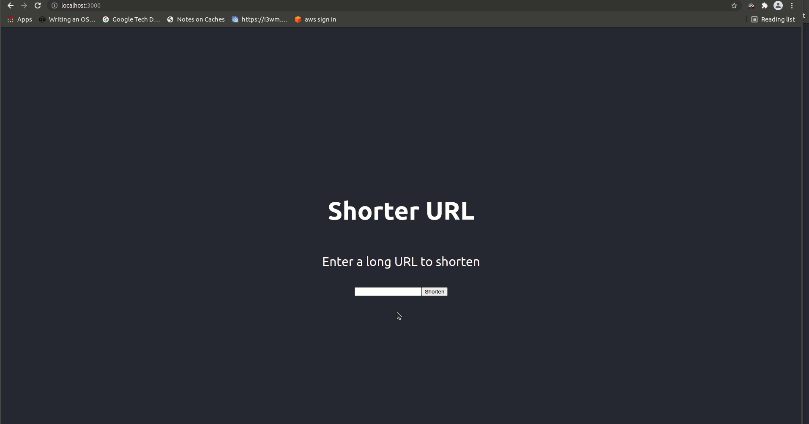

# shorter-url

A basic URL shortener written in Java with Spring & MongoDB , with a simple React frontend, packaged with Docker.

## Getting started

The quickest way to run the project is with Docker Compose. This will build, package and run the project.
```
docker-compose up
```
First time startup may take a few minutes while Docker builds and downloads packages

Then visit
```
http://localhost:3000
```


